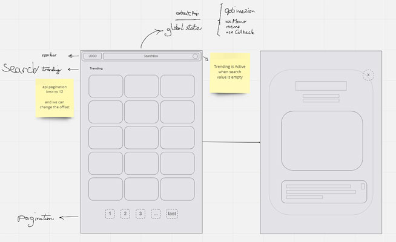
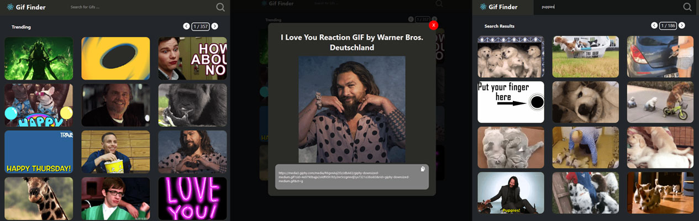

# React Gif Finder App Challenge

The Gif Finder is a simple app challenge completed in around 3.5 hours for the bare bone of the project. I spend some extra time on refactoring the code, manually testing the app and add responsive styling to some sections. I decided to bootstrap the app with bootstrapped with [Create React App](https://github.com/facebook/create-react-app), becasue it is a recommendation from the react docs and facilitates the initialization of a bare bone project. For the app styling I used `css` over `sass` becasue I'm usually having more fun with that for quick small projects.

## Project Structure

I initially drew a quick wireframe as a visual guide to pre-plan a layout and facilitate a mental roadmap of which react hooks and features I would use in the process.

I refactored and organized the code in to the following structure:

- root
    - public
    - src
        - api: consists of the api service and giphy endpoints
        - assets: consists of images, can host the fonts or other assets later.
        - components: three main components of the layout with each of their child components
            -   Modal
            -   Content (body)
            -   Navbar
        - context: The global state of our application, functional logics, and where api calls merge into state.
        - layout: The folder that would consist different application layout, only consisting a singe default layout in this project.
        - types: global manually written giphy typescript type modules.

### Demo

A live view of the app is deployed on `Vercel` and you can [PREVIEW HERE](#)

### Notes

* Overall, I tried to include intention-revealing names for all variables to keep the code undestandable for others.
* I tested the app for responsiveness on 14 development device screens, expecting it be functionally responsive. 
* While the app is mannually end to end tested. The challenge timeline confinded me to skip unit test writing, but I can add in a later commit.

## Available Scripts

In the project directory, you can run:

### `npm dev`

Runs the app in the development mode.\
Open [http://localhost:3000](http://localhost:3000) to view it in the browser.

The page will reload if you make edits.\
You will also see any lint errors in the console.

### `npm test`

Launches the test runner in the interactive watch mode.\
See the section about [running tests](https://facebook.github.io/create-react-app/docs/running-tests) for more information.

### `npm run build`

Builds the app for production to the `build` folder.\
It correctly bundles React in production mode and optimizes the build for the best performance.

The build is minified and the filenames include the hashes.\
Your app is ready to be deployed!

See the section about [deployment](https://facebook.github.io/create-react-app/docs/deployment) for more information.

## Learn More

You can learn more in the [Create React App documentation](https://facebook.github.io/create-react-app/docs/getting-started).

To learn React, check out the [React documentation](https://reactjs.org/).
